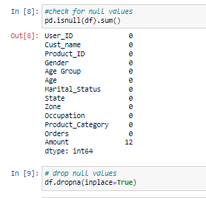
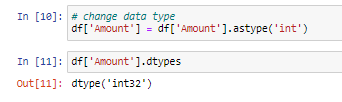

# Diwali_Sales_Analysis

# Project Overview

The "Diwali Sales Analysis" project is an exploration of sales data during the Diwali season, focusing on understanding purchasing trends and sales performance on the basis of different categories. Leveraging the power of Python and the Pandas library, this project aims to extract valuable insights from Diwali sales data and provide a data-driven perspective on this festive season.

# Project Outline

1. Analyze Diwali season sales data to extract insights for enhancing future festive season strategies.
2. Detect and understand trends and patterns to guide future planning for festive seasons.

# Data Cleaning and Preprocessing

In this project, I harnessed the power of Pandas, a versatile Python library, to meticulously clean and preprocess our raw data. Data cleaning and preprocessing are foundational steps in any data analysis project, as they ensure that the data is in a suitable form for meaningful analysis and insights.

1. Handling Missing Data:

Dealing with missing data is a critical aspect of data preprocessing. Using Pandas, I identified missing values within the dataset and employed strategies such as imputation or removal to address these gaps. This step helped enhance the completeness and reliability of the data.

2. Data Cleansing:

Data inconsistencies, such as typos, duplicate entries, or irregular formatting, can compromise the quality of analysis. Leveraging Pandas, we meticulously cleaned the data, rectifying these inconsistencies to ensure data uniformity and accuracy.

# Exploratory Data Analysis (EDA)

Exploratory Data Analysis (EDA) is the heartbeat of any data analysis project, and in this project, leveraged EDA to unearth valuable insights from this dataset. EDA is the process of visually and statistically summarizing and interpreting data, and it plays a pivotal role in understanding the underlying patterns and relationships within the dataset.

1. Visual Storytelling:
Visualizations are a powerful means of storytelling, and I have used Python libraries like Matplotlib and Seaborn to craft compelling visuals. These included bar charts which helped to communicate my findings effectively.

